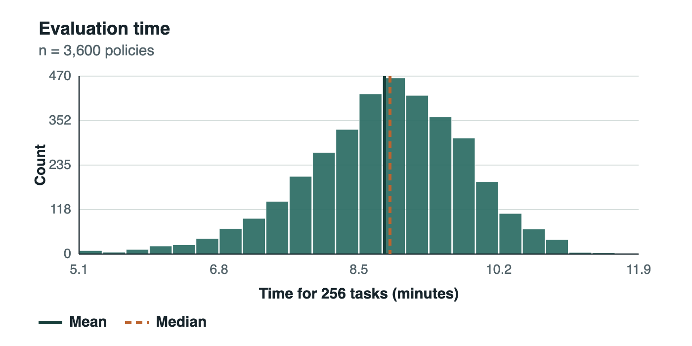
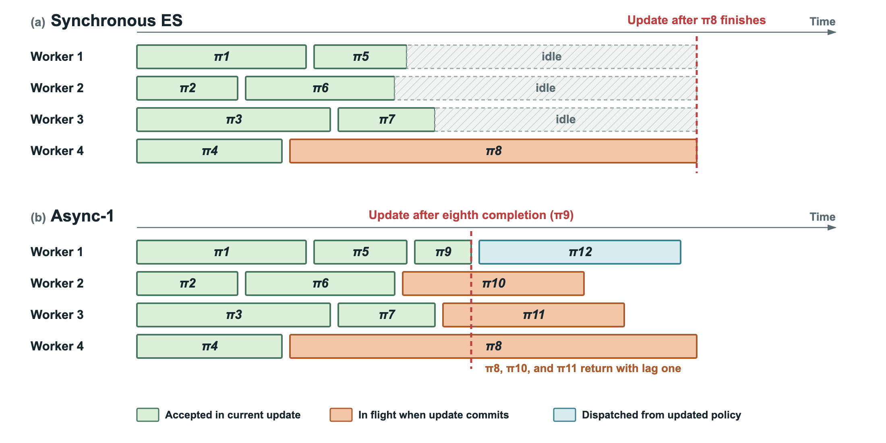
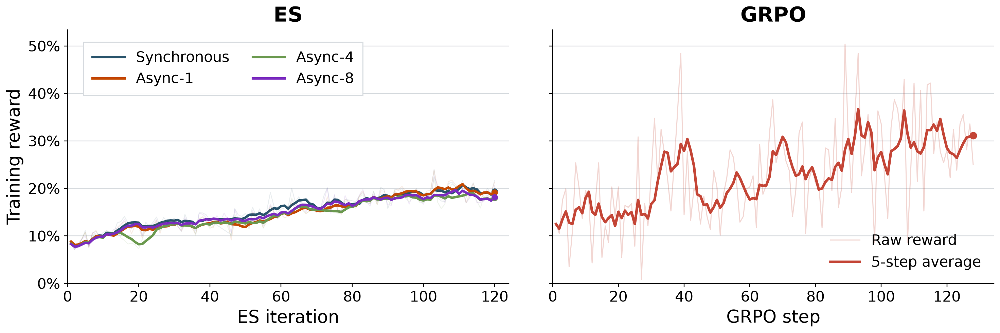
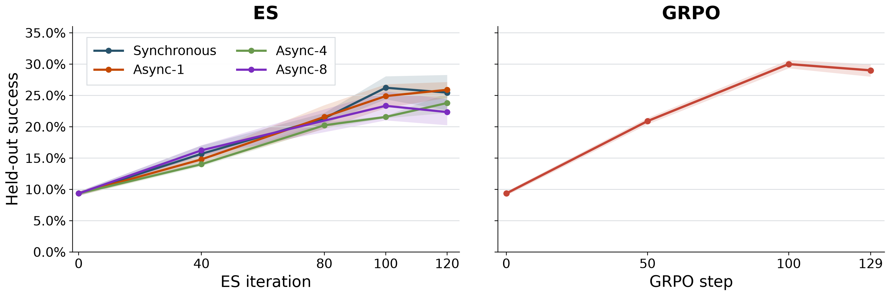

# Asynchronous Is Nearly Free for Evolution Strategies on Long-Horizon Agentic Tasks

William Hoy¹ · Jingxuan Fan² · Nurcin Celik¹ · Xu Pan²<br>
¹ University of Miami · ² Harvard University<br>
September 29, 2026

Async ES is a bounded-staleness trainer for applying evolution strategies to long-horizon, stateful language agents. It continuously dispatches perturbation evaluations as workers become available, while limiting how stale a result may be when included in an update.

This repository provides the trainer, its Endless Terminals integration, and initial results with Qwen2.5-7B-Instruct.

The reported configuration uses Natural Async-1, which accepts results with a maximum policy lag of one update. Synchronous ES, controlled-lag schedules, and GRPO are reported as experimental comparisons.

## Why asynchronous ES?

Long-horizon agent rollouts have highly variable completion times. Some terminal
tasks finish after only a few turns, while others consume the full interaction
budget. Synchronous ES cannot update until every perturbation in the population
has finished, so faster workers sit idle at the end of each cohort.

The distribution below contains all 3,600 perturbation evaluations from the
120-update synchronous ES run. Each perturbation was evaluated on 256 Endless
Terminals tasks. Evaluation times ranged from approximately 5.1 to 11.9 minutes,
and the variation was large enough to create a repeated synchronization
bottleneck.



*Synchronous ES workload distribution. The solid and dashed lines denote the
mean and median evaluation time.*

## Asynchronous ES

### From a synchronous population to a continuous queue

Let $G$ denote the number of GPU workers and $N$ the ES update-cohort size.
Synchronous ES evaluates all $N$ perturbations around the same central policy
$\theta_t$ and waits for all of them before applying an update.

Natural asynchronous ES instead maintains up to $G$ perturbation evaluations in
flight. When a worker finishes, its result is processed immediately and the
worker begins another perturbation without waiting for the rest of the cohort.



*An illustrative schedule with four workers and an eight-result update cohort.
Synchronous ES waits for the slowest result. Async-1 commits after the eighth
completion while unfinished evaluations remain in flight.*

### ES update

Evolution strategies optimize model parameters using zeroth-order,
population-based estimates. At update $t$, each worker samples a perturbation

$$
\boldsymbol{\epsilon}_i \sim \mathcal{N}(0, I)
$$

and evaluates the perturbed policy

$$
R_i = R\!\left(\theta_t + \sigma\boldsymbol{\epsilon}_i\right),
$$

where $\sigma$ is the Gaussian noise scale. Rewards are standardized across the
accepted cohort:

$$
Z_i = \frac{R_i - \mu_R}{\sigma_R + 10^{-8}}.
$$

The central policy update is

$$
\theta_{t+1} = \theta_t + \frac{\alpha}{N}
\sum_{i=1}^{N} Z_i \boldsymbol{\epsilon}_i.
$$

where $\alpha$ is the ES step size. Perturbations are regenerated
deterministically from their random seeds, so workers exchange seeds and scalar
rewards instead of complete perturbed models.

### Bounded policy staleness

In asynchronous ES, a reward may have been evaluated around an earlier central
policy. A completed job returns its perturbation seed, scalar reward $R_i$, and
dispatch policy version $v_i$:

$$
R_i = R\!\left(\theta_{v_i} + \sigma\boldsymbol{\epsilon}_i\right).
$$

If the current central-policy version is $t$, the result's policy lag is

$$
\ell_i = t - v_i.
$$

The coordinator accepts the result only when

$$
\ell_i \leq \ell_{\max},
$$

where $\ell_{\max}$ is the configured maximum policy lag. Results beyond this
bound are discarded and replaced by later completions. Once $N$ accepted
results have accumulated, their rewards are standardized and their perturbation
seeds are replayed to construct the next central-policy update.

After completing an evaluation, each worker:

1. removes its temporary perturbation;
2. replays any central-policy updates committed while it was busy;
3. applies a new seeded perturbation to the current policy; and
4. begins the next rollout batch immediately.

This produces update cohorts that may mix fitness measurements from several
recent policy versions, while ensuring every member satisfies the same explicit
staleness bound.

## Experimental setup

We initialized every method from Qwen2.5-7B-Instruct and trained on
[Endless Terminals](https://github.com/kanishkg/endless-terminals), a stateful,
multi-turn terminal benchmark with highly variable trajectory lengths.

| Split | Tasks | Use |
|---|---:|---|
| Train | 2,083 | Policy optimization |
| Validation | 100 | In-training evaluation |
| Test | 300 | Final held-out evaluation |

All methods used the same rollout and sampling configuration. Each trajectory
was limited to 16 interaction turns, 2,048 generated tokens per turn, a
16,384-token rolling context, and a 300-second execution timeout. Responses
were sampled at temperature 0.6 with top-$p=1.0$ and no top-$k$ truncation.

### Compared methods

| Method | Update construction |
|---|---|
| Synchronous ES | 30 fresh perturbation evaluations; wait for the complete cohort |
| Natural Async-1 | Continuously dispatch work; accept results with lag 0 or 1 |
| Controlled Async-4 | 27 fresh results and three results delayed by exactly four updates |
| Controlled Async-8 | 27 fresh results and three results delayed by exactly eight updates |
| GRPO | 16 tasks with 16 rollouts per task, or 256 trajectories per step |

Every ES update contained 30 perturbations, each evaluated on 256 tasks. ES
training ran for 120 updates. Natural Async-1 used four concurrent workers and
accepted a maximum policy lag of one update.

With four workers and a cohort of 30, at most three older-policy evaluations
can remain in flight when an update commits. Across the run, 114 of 120 cohorts
contained exactly three one-update-old results; the other six were entirely
fresh after the initial launch or a job resumption. The observed stale-result
fraction was therefore

$$
\frac{114 \times 3}{120 \times 30} = 9.5\%.
$$

Controlled Async-4 and Async-8 fix that fraction at 10% after warm-up. These
schedules isolate the optimization effect of policy lag by delaying three
results per cohort, independently of any utilization benefit.

## Results

### Training reward



*Native-step training reward. ES updates and GRPO steps represent different
amounts of compute and should not be compared one-to-one.*

All four ES schedules follow similar reward trajectories over 120 updates.
Controlled staleness as large as eight updates does not substantially alter the
observed optimization path, although the higher-lag methods separate during
late held-out evaluation. GRPO reaches a higher training reward and exhibits
larger batch-to-batch fluctuations.

### Held-out task success



*Mean success on the 300-task held-out split across three stochastic evaluation
seeds.*

| Method | Final checkpoint | Held-out success |
|---|---:|---:|
| Base model | 0 | 9.3% |
| Synchronous ES | 120 | 25.4% |
| Natural Async-1 | 120 | **25.9%** |
| Controlled Async-4 | 120 | 23.8% |
| Controlled Async-8 | 120 | 22.3% |
| GRPO | 129 | 29.0% |

Natural Async-1 matches the synchronous result in this four-worker setting.
Delaying 10% of each update cohort by four updates reduces final success by 1.6
percentage points relative to synchronous ES; delaying the same fraction by
eight updates reduces it by 3.1 points. The degradation is gradual rather than
an immediate collapse, even though stale evaluations are accepted without an
off-policy correction.

### GRPO comparison

GRPO reaches 30.0% held-out success at step 100 and 29.0% at its final step,
above the best ES result of approximately 26%. Neither method received an
extensive benchmark-specific hyperparameter sweep.

ES does not require reference-model inference or backpropagation. Its workers
therefore operate at inference-level memory and perturbation evaluations can be
distributed independently. The tradeoff in this experiment is total model
compute: under the approximation below, one ES update costs approximately 4.29
GRPO steps.

### General-capability evaluation

We evaluated the final checkpoint from each method on MMLU-Pro and HellaSwag.
GRPO finishes slightly above the base model, while every ES schedule shows some
degradation.

| Method | Checkpoint | MMLU-Pro | Change | HellaSwag | Change |
|---|---:|---:|---:|---:|---:|
| Base | Qwen2.5-7B-Instruct | 0.5679 | - | 0.8315 | - |
| GRPO | 129 | 0.5708 | +0.0029 | 0.8384 | +0.0068 |
| Synchronous ES | 120 | 0.5400 | -0.0278 | 0.8203 | -0.0112 |
| Natural Async-1 | 120 | 0.5391 | -0.0288 | 0.8159 | -0.0156 |
| Controlled Async-4 | 120 | 0.5591 | -0.0088 | 0.8081 | -0.0234 |
| Controlled Async-8 | 120 | 0.5469 | -0.0210 | 0.8286 | -0.0029 |

This does not establish irreversible forgetting. Recent work suggests that
post-training degradation under ES can reflect transient parameter drift,
varies with the task sequence, and decreases with larger populations. Because
we evaluate one final checkpoint per method at a single population size, these
runs cannot separate transient drift from permanent capability loss. The
relative ordering of the asynchronous schedules also differs between the two
benchmarks, so there is no evidence here that policy lag protects against
forgetting.

## Compute comparison

The following model-FLOP approximation uses $P$ model parameters and $L$
processed tokens. It includes model inference and optimization but excludes
environment execution and sandbox grading.

For GRPO, the run used $B=16$ prompts, $G=16$ rollouts per prompt, and two
actor-optimization epochs. Assuming reference log probabilities are computed
once and cached, the first epoch contains generation, reference inference, and
a policy backward pass; the second contains a policy forward and backward pass:

$$
\begin{aligned}
C_{\mathrm{GRPO}}^{(1)} &= 8BGPL, \\
C_{\mathrm{GRPO}}^{(2)} &= 6BGPL.
\end{aligned}
$$

The complete GRPO step therefore costs

$$
C_{\mathrm{GRPO}}
= 14 \times 16 \times 16\,PL
= 3{,}584\,PL.
$$

An ES update evaluates $N=30$ perturbations on $D=256$ tasks using forward
passes only:

$$
C_{\mathrm{ES}}
= 2NDPL
= 2 \times 30 \times 256\,PL
= 15{,}360\,PL.
$$

Thus,

$$
\frac{C_{\mathrm{ES}}}{C_{\mathrm{GRPO}}}
= \frac{15{,}360}{3{,}584}
\approx 4.29.
$$

| ES update | GRPO-equivalent step | Compute relative to full 129-step GRPO run |
|---:|---:|---:|
| 40 | 171.4 | 1.33x |
| 80 | 342.9 | 2.66x |
| 100 | 428.6 | 3.32x |
| 120 | 514.3 | 3.99x |

## Limitations

These experiments use four concurrent GPU workers. Under that configuration,
natural Async-1 produces a 9.5% stale-result fraction with a maximum lag of one.
Larger lags do not arise naturally, so Async-4 and Async-8 are controlled
ablations rather than measurements of naturally occurring lag at larger worker
counts.

We did not perform extensive benchmark-specific hyperparameter sweeps for
either ES or GRPO. The reported results compare the configurations we ran, not
the best performance attainable by either method. In particular, population
size, perturbation scale, ES step size, GRPO learning rate, regularization, and
the rollout configuration may all affect the relative outcome.

Larger-scale runs should also test
whether asynchronous ES benefits from safeguards analogous to the clipping,
trust-region constraints, and regularization commonly used in policy-gradient
training.

## Run Async ES

Prepare the dataset and task containers with the
[Endless Terminals setup](tasks/endless_terminals/README.md), then run the
four-worker configuration:

```bash
set -a
source configs/endless_full.env
set +a
scripts/run_endless_async.sh
```

The launcher writes checkpoints, update records, evaluations, and final weights
under `outputs/<run_name>/`.

## Evaluate

Evaluate a native ES checkpoint:

```bash
python scripts/evaluate_endless.py \
  --checkpoint /path/to/iteration_000120_model_weights.pt
```

Evaluate a Hugging Face model or merged GRPO checkpoint:

```bash
python scripts/evaluate_endless.py \
  --model /path/to/grpo_huggingface_merged
```

The evaluator runs the 300 held-out tasks with seeds 42, 43, and 44 and writes
the individual runs plus an aggregate summary under `outputs/evaluation/`.

## Natural Async-1 configuration

| Parameter | Value |
|---|---|
| Model | Qwen2.5-7B-Instruct |
| Parameterization | Full-parameter |
| ES update cohort | 30 perturbations |
| Training tasks per perturbation | 256 |
| Concurrent GPU workers | 4 |
| Gaussian noise scale | 0.0015 |
| ES step size | 0.00075 |
| Updates | 120 |
| Maximum accepted policy lag | 1 update |
| Interaction turns | 16 |
| Maximum generated tokens per turn | 2,048 |
| Rolling context | 16,384 tokens |
| Environment timeout | 300 seconds |
| Sampling temperature | 0.6 |
| Top-p | 1.0 |
| Top-k | Disabled |

The scalar GRPO baseline used 16 prompts with 16 rollouts each, two actor
optimization epochs, AdamW with learning rate $10^{-6}$, weight decay 0.01,
gradient clipping at 1.0, PPO clipping at 0.2, and a loss-side $k_3$ KL penalty
with coefficient $10^{-3}$. It completed one training epoch in 129 steps.

For the general-capability evaluation, every checkpoint was evaluated on the
same 2,048 examples from MMLU-Pro and HellaSwag using seed 2357, greedy decoding,
and a maximum generation length of 1,024 tokens.

## Related work

- [Evolution Strategies at Scale](https://arxiv.org/abs/2509.24372)
- [Agentic ESOpt](https://arxiv.org/abs/2608.17310)
- [Evolutionary Strategies Lead to Catastrophic Forgetting in LLMs](https://arxiv.org/abs/2601.20861)
- [Overcoming Forgetting in LLM Fine-Tuning with Evolution Strategies](https://arxiv.org/abs/2605.30148)
- [Matching Accuracy, Different Geometry](https://arxiv.org/abs/2604.01499)

## Coming soon to repo

Async ES is an active research release. LoRA parameterization, more long-horizon
agent benchmarks, and broader model testing are coming soon.

## Citation

If you use Async ES, please cite this repository:

```bibtex
@software{hoy2026asynces,
  author  = {Hoy, William and Fan, Jingxuan and Celik, Nurcin and Pan, Xu},
  title   = {Asynchronous Is Nearly Free for Evolution Strategies on Long-Horizon Agentic Tasks},
  year    = {2026},
  url     = {https://github.com/Bhoy1/async-es}
}
```

## License and attribution

This project builds on
[ES at Scale](https://github.com/VsonicV/es-at-scale) and evaluates on the
[Endless Terminals](https://github.com/kanishkg/endless-terminals) benchmark.

The research code derives utility code from `es-at-scale` and is distributed
under the included noncommercial Academic Public License. See
[LICENSE.txt](LICENSE.txt) and [THIRD_PARTY_NOTICES.md](THIRD_PARTY_NOTICES.md).
